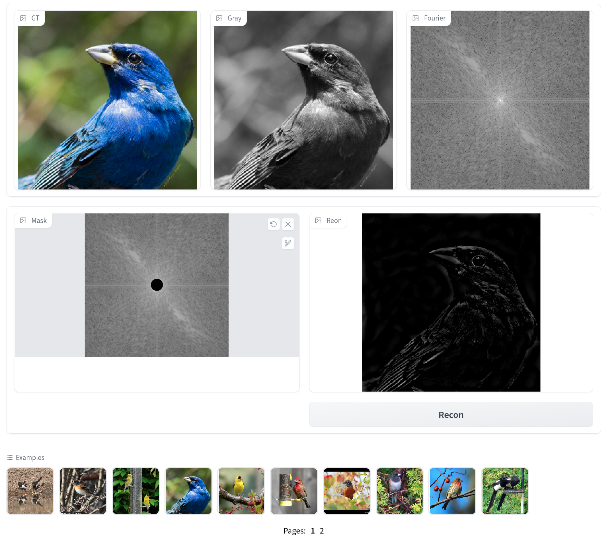

## Fourier Domain

The GUI demo helps to improve the intuitions of fourier domain of image data. 
The program features are as follow
- Visualization on fourier spectrum.
- Realtime reconstruction on masked fourier domain

<figure>

<figcaption align = "center"><b>GUI Example</b></figcaption>
</figure>
